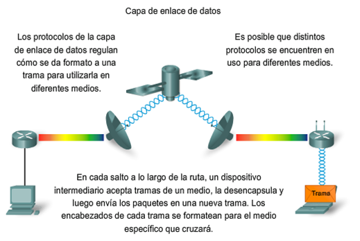
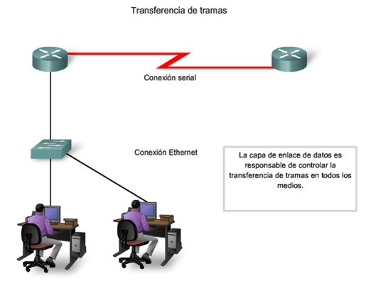
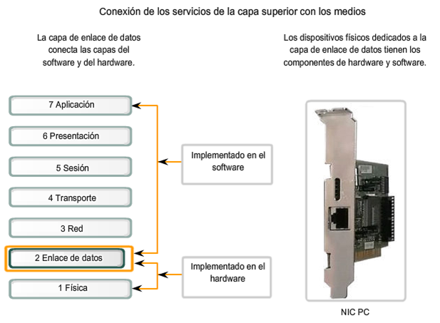
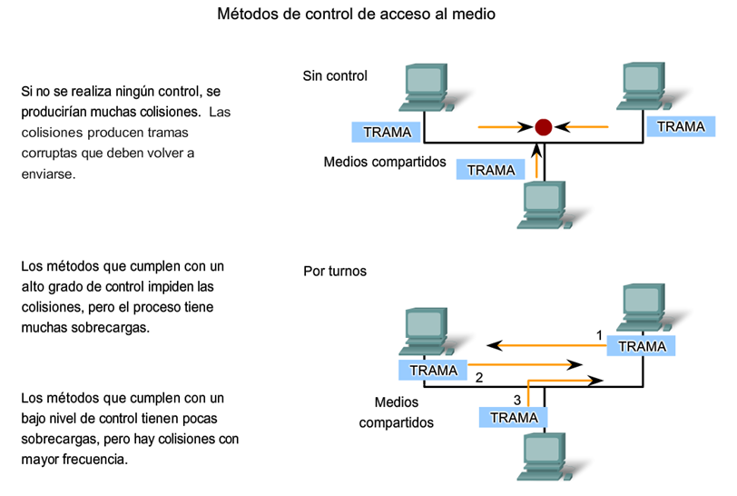
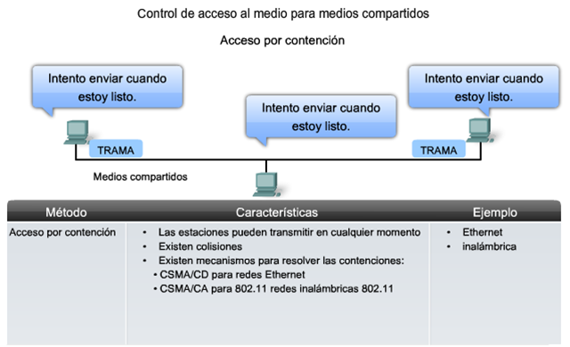

# CAPA ENLACE DE DATOS: “CONTROL DE ACCESO AL MEDIO”

-----------------------------------------

# Funciones:

La capa de enlace de datos proporciona un medio para intercambiar datos a través de medios locales comunes.
La capa de enlace de datos realiza dos servicios básicos:

 - Permite a las capas superiores acceder a los medios usando técnicas, como tramas.
 - Controla cómo los datos se ubican en los medios y son recibidos desde los medios usando técnicas como control de acceso a los medios y detección de errores.

----------------

------------------------------------

# CONCEPTOS:

 - **Trama:** el [PDU](http://en.wikipedia.org/wiki/Protocol_data_unit)(_protocol data unit_) de la capa de enlace de datos.
 - **Nodo:** la notación de la Capa 2 para dispositivos de red conectados a un medio común.
 - **Medios/medio (físico):** los medios físicos para la transferencia de información entre dos nodos.
 - **Red (física):** dos o más nodos conectados a un medio común.

La capa de enlace de datos es responsable del intercambio de tramas entre nodos a través de los medios de una red física.

---------------------

Es probable que numerosos Protocolos de capa de enlace de datos se estén usando para transportar paquetes **IP** a través de varios tipos de LAN y WAN. Este intercambio de paquetes entre dos hosts requiere una diversidad de protocolos que debe existir en la capa de enlace de datos. Cada transición a un router puede requerir un protocolo de capa de enlace de datos diferente para el transporte a un medio nuevo.

Los protocolos de la Capa 2 especifican la encapsulación de un paquete en una trama y las técnicas para colocar y sacar el paquete encapsulado de cada medio. La técnica utilizada para colocar y sacar la trama de los medios se llama **método de control de acceso al medio**.

Los **métodos de control de acceso al medio** descritos en los protocolos de capa de enlace de datos definen los procesos por los cuales los dispositivos de red pueden acceder a los medios de red y transmitir marcos (frames) en diferentes entornos de red.

El adaptador ([NIC](http://en.wikipedia.org/wiki/Network_interface_controller)) administra la trama y el control de acceso a los medios.

A medida que el router procesa tramas, utilizará los servicios de la capa de enlace de datos para recibir la trama desde un medio, desencapsularlo en la PDU de la Capa 3, reencapsular la PDU en una trama nueva y colocar la trama en el medio del siguiente enlace de la red.

------------------------------------------

# TRANSFERENCIA DE TRAMAS

La Capa de enlace de datos prepara un paquete para transportar a través de los medios locales encapsulándolo con un encabezado y un tráiler para crear una trama.
la trama de la capa de enlace de datos incluye:

-----------------------------------------

# TRANSFERENCIA DE TRAMAS

 - **Encabezado:** contiene información de control como direccionamiento y está ubicado al comienzo del PDU.
 - **Datos:** El paquete desde la Capa de red.
 - **Tráiler:** Contiene información de control agregada al final del PDU.

--------------------------------------------------------------

# NIC

La capa de enlace de datos existe como una capa de conexión entre los procesos de software de las capas por encima de ella y la capa física debajo de ella. Como tal, prepara los paquetes de capa de red para la transmisión a través de alguna forma de medio, ya sea cobre, fibra o entornos o medios inalámbricos.
El software asociado con la NIC (Network Interface Controller) permite que la NIC realice sus funciones de intermediara preparando los datos para la transmisión y codificando los datos como señales que deben enviarse sobre los medios asociados.

> **NOTA:**  La nic es un controlador de interfaz de red, conocido como: “tarjeta de interfaz de red”, “LAN adaptador”; hardware informático que conecta un ordenador a una red de ordenadores.

--------------------------------------------------------------

# NIC

-----------------------------------------------

#SUB CAPAS DE ENLACE DE DATOS

Para sostener una gran variedad de funciones de red, la capa de enlace de datos a menudo se divide en dos subcapas: una subcapa superior y una sub capa inferior.

 - Superior define los procesos de software que proveen servicios a los Protocolos de capa de red.
 - Inferior define los procesos de acceso a los medios realizados por el hardware.

### CONTROL DE ENLACE LOGICO (_LLC_)

coloca información en la trama que identifica qué protocolo de capa de red está siendo utilizado por la trama. Esta información permite que varios protocolos de la Capa 3, tales como IP e IPX, utilicen la misma interfaz de red y los mismos medios.
Control de acceso al medio

### El control de acceso al medio (_MAC_)

proporciona a la capa de enlace de datos el direccionamiento y la delimitación de datos de acuerdo con los requisitos de señalización física del medio y al tipo de protocolo de capa de enlace de datos en uso.
Los protocolos en la capa de enlace de datos definen las reglas de acceso a los diferentes medios.

--------------------------------------------

# Metodos del control de acceso al medio (_MAC_)

--------------------------------------------

# TÉCNICAS MAC

>  Métodos básicos de control de acceso al medio para medios compartidos:

### Controlado:

 - **Controlado:** Cada nodo tiene su propio tiempo para utilizar el medio.
 - **Acceso controlado para medios compartidos:** los dispositivos de red toman turnos para acceder al medio. Cuando un dispositivo coloca una trama en los medios, ningún otro dispositivo puede hacerlo hasta que la trama haya llegado al destino y haya sido procesada por el destino.

![acceso-controlado.png]

--------------------------------------------

# TÉCNICAS MAC
### contención:

 - **Basado en la contención:** Todos los nodos compiten por el uso del medio.
 - **Acceso por contención para medios compartidos:** permiten que cualquier dispositivo intente acceder al medio siempre que haya datos para enviar.

------------------------------------------------

# [Dacceso múltiple con detección de portadora](http://en.wikipedia.org/wiki/Carrier_sense_multiple_access)

## CSMA/Detección de colisión:

En CSMA/Detección de colisión (CSMA/CD), el dispositivo monitorea los medios para detectar la presencia de una señal de datos. Si no hay una señal de datos, que indica que el medio está libre, el dispositivo transmite los datos. Si luego se detectan señales que muestran que otro dispositivo estaba transmitiendo al mismo tiempo, todos los dispositivos dejan de enviar e intentan después. Las formas tradicionales de Ethernet usan este método.

## CSMA/Prevención de colisiones:

En CSMA/Prevención de colisiones (CSMA/CA), el dispositivo examina los medios para detectar la presencia de una señal de datos. Si el medio está libre, el dispositivo envía una notificación a través del medio, sobre su intención de utilizarlo. El dispositivo luego envía los datos. Este método es utilizado por las tecnologías de redes inalámbricas 802.11.

----------------------------------------------------

## SIMPLEX, FULL DUPLEX Y HALF DUPLEX

En conexiones punto a punto, la Capa de enlace de datos tiene que considerar si la comunicación es half-duplex o full-duplex.

 - **simplex**: Solo uno trasmite y el otro es receptor.
 - **half-duplex**: quiere decir que los dispositivos pueden transmitir y recibir en los medios pero no pueden hacerlo simultáneamente.
 - **full-duplex**: los dos dispositivos pueden transmitir y recibir en los medios al mismo tiempo.

