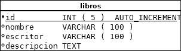

## Base de datos II, parcial I, MySQL.

**Nombre Completo:** _______________________________________________

**1. En MySQL, si necesitamos utilizar claves ajenas y transacciones, debemos utilizar el motor**:

- **a)** Blackhole
- **b)** InnoDB
- **c)** MyISAM
- **d)** Ninguna de las anteriores es correcta.

> **Instrucciones:** A continuación se muestra la base de datos **biblioteca** en la que se puede observar la tabla **libros**. Dada esta información y basándose en el diagrama responda las siguientes preguntas:

> 

**2. Si el usuario es `user_x` y la contraseña es `user_pass`, subraye las formas correctas de ejecutar el cliente `mysql` para conectarse con el servidor MySQL.**

- **a)** `mysql -u user_x -p user_pass`
- **b)** `mysql --login=user_x  --password=user_pass`
- **c)** `mysql --user=user_x --password=user_pass`
- **d)** Ninguna de las anteriores es correcta.

**3. Una vez conectados si deseamos ver las bases de datos existentes en el servidor MySQL, entonces podemos ejecutar la instrucción:**

- **a)** `VIEW DATABASES`
- **b)** `SELECT name FROM DATABASES`
- **c)** `SHOW DATABASES`
- **d)** `DESCRIBE DATABASES`

**4. Para seleccionar la base de datos `bibloteca` que es con la que queremos trabajar entonces podemos ejecutar la instrucción:**

- **a)** `WORK WITH biblioteca`
- **b)** `USE bibloteca`
- **c)** `SET WORKSPACE biblioteca`
- **d)** Todas las anteriores son correctas.

**5. Para mostrar la estructura de una tabla `libros` se emplea el comando:**

- **a)** `SHOW libros`
- **b)** `DESCRIBE libros`
- **c)** `VIEW libros`
- **d)** Ninguna de las anteriores.

**6. En MySQL, para seleccionar las filas de la 6 a la 15 en una tabla, se emplea la cláusula:**

- **a)** SELECT * FROM libros LIMIT 6,15;
- **b)** SELECT * FROM libros LIMIT 6,10;
- **c)** SELECT * FROM libros LIMIT 5,10;
- **d)** Las anteriores respuestas no son correctas.

**7. Use la instrucción `CREATE TABLE IF NOT EXISTS` para definir la tabla `libros`:**

**8. Inserte los siguientes datos:**

<table>
	<thead>
		<tr>
			<th>Id</th>
			<th>Nombre</th>
			<th>Escritor</th>
			<th>Descricion</th>
		</tr>
	</thead>
	<tbody>
		<tr>
			<td>1</td>
			<td>La biblia</td>
			<td>Jesús</td>
			<td>El libro mas impreso del mundo</td>
		</tr>
		<tr>
			<td>2</td>
			<td>La cabaña</td>
			<td>Wm. Paul Young</td>
			<td></td>
		</tr>
	</tbody>
</table>

**9. Escriba una consulta SQL, que cambie(actualice, update) el escritor del libro "la biblia" para que el nuevo valor en el escritor sea "varios".**

**10. Finalmente escriba una consulta SQL que borre todos los registros existentes en la tabla `libros`.**