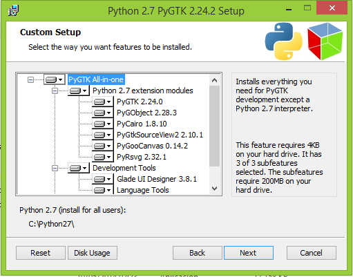
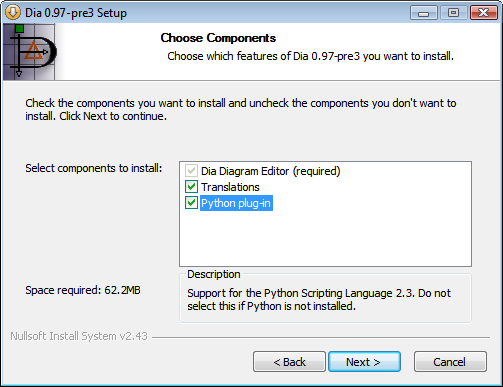
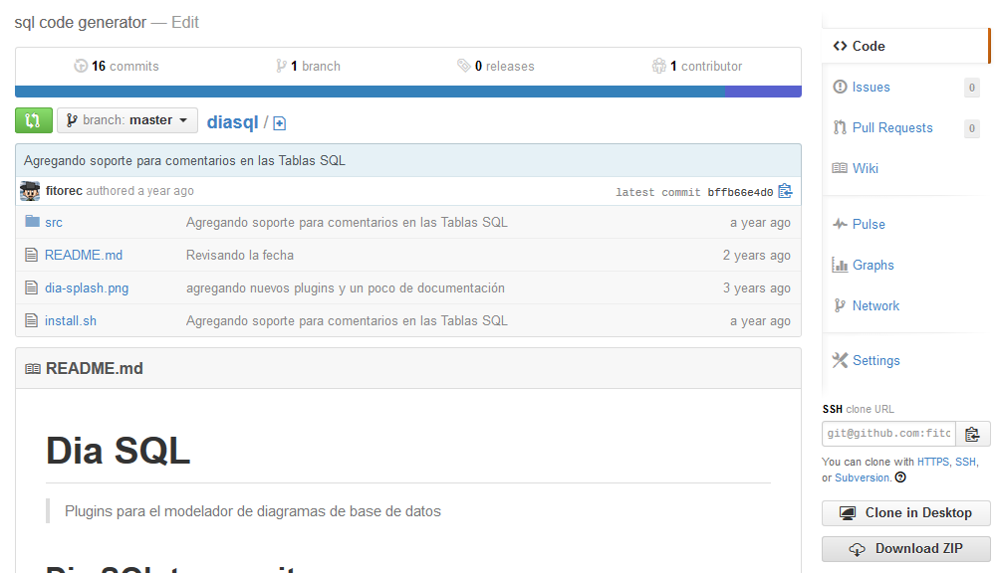

# Instalación de DIA con soporte python

Esta documentación fue extraída de:

> <http://dia-installer.de/howto/python_win32/index.html.en#setup_pygtk>

# Instalación de python 2.3

Esta disponible en: http://python.org/download/releases/2.3.5/

URL de descarga: http://python.org/ftp/python/2.3.5/Python-2.3.5.exe.

## Instalación de pyGTK

> <http://www.pygtk.org/>

### Lista de binarios pyGTK

> <http://ftp.gnome.org/pub/GNOME/binaries/win32/pygtk/2.8/pygtk-2.8.6-1.win32-py2.3.exe>

>

## Instalando DIA
Accedemos a:
> <http://dia-installer.de/download/index.html.en>

>

## Agregadno DIASQL

> <https://github.com/fitorec/diasql>

>
>