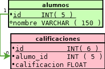

# Claves foreaneas:

En el contexto de bases de datos relacionales, una clave foránea o clave ajena (o `Foreign Key FK`) es una limitación _referencial_ entre dos tablas.

La clave foránea identifica una columna o grupo de columnas en una tabla **referendo** (_hija_) que se refiere a una columna o grupo de columnas en otra tabla **referenciada**(_maestra ó padre_). Las columnas en la tabla referendo deben ser la clave primaria u otra clave candidata en la tabla referenciada.

>

	

> <small>En el ejemplo podemos apreciar la tabla referendo/reverenciada</small>

-------------------------------------------------------------

# Claves foreaneas con innoDB

## Condiciones:

 - Ambas tablas deben ser **InnoDB** y no deben ser tablas temporales.

 - En la tabla que hace referencia, debe haber un índice donde las columnas de clave extranjera estén listadas en primer lugar, en el mismo orden.

 - En la tabla referenciada, debe haber un índice donde las columnas referenciadas se listen en primer lugar, en el mismo orden. En _MySQL/InnoDB 5.0_, tal índice se creará automáticamente en la tabla referenciada si no existe aún.

-------------------------------------------------------------

# Condiciones:

 - No están soportados los índices prefijados en columnas de claves foráneas. Una consecuencia de esto es que las columnas `BLOB` y `TEXT` no pueden incluirse en una clave foránea, porque los índices sobre dichas columnas siempre deben incluir una longitud prefijada.

 - Si se proporciona un `CONSTRAINT símbolo`, éste debe ser único en la base de datos. Si no se suministra, **InnoDB** crea el nombre automáticamente.

-------------------------------------------------------------

## Sintaxis extendida:

	!mysql
    REFERENCES nombre_de_tabla (nombre_indice, ...)
    	[ON DELETE {RESTRICT | CASCADE | SET NULL | NO ACTION}]
    	[ON UPDATE {RESTRICT | CASCADE | SET NULL | NO ACTION}]

Quizás queda mas claro con un ejemplo mas sencillo.

## Sintaxis básica:

	!mysql
	FOREIGN KEY (campo_ref)
		REFERENCES nombre_tabla(nombre_campo)

-------------------------------------------------------------

# Ejemplo:

##Creando tabla Alumnos

	!mysql
	CREATE TABLE IF NOT EXISTS `alumnos` (
 		 `id` INT( 5 ) NOT NULL AUTO_INCREMENT,
  		`nombre` VARCHAR( 100 ) DEFAULT NULL,
 		 PRIMARY KEY (`id`)
	) ENGINE=InnoDB DEFAULT CHARSET=latin1 AUTO_INCREMENT=1 ;

## Creando tabla Calificaciones:

	!mysql
	CREATE TABLE IF NOT EXISTS `calificaciones`(
		`id` int( 7 ) PRIMARY KEY AUTO_INCREMENT,
		`alumno_id` INT( 5 ),
		`calificacion` FLOAT,
		INDEX `alumno_calificaciones` (`alumno_id`),
		FOREIGN KEY (`alumno_id`)
			REFERENCES alumnos(`id`)
			ON DELETE CASCADE
	) ENGINE=INNODB;

-------------------------------------------------------------

# Insertando datos en alumnos no existentes:

	!mysql
	INSERT INTO `calificaciones` (`id`, `alumno_id`, `calificacion`)
		VALUES (NULL, '2', '5.5');

## ¿que crees que pase?

 - Inserta los datos, pero con una advertencia
 - No inserta los datos.
 - Inserta los datos de forma exitosa, ya que la referencia es cuando se eliminen los datos en cascada.

------------------------------------------------------------- 

# Error inconsistencia de datos

	#1452 - Cannot add or update a child row:
	a foreign key constraint fails (
		`clase_bd_2`.`calificaciones`,
		CONSTRAINT `calificaciones_ibfk_1`
		FOREIGN KEY (`alumno_id`)
		REFERENCES `alumnos` (`id`) ON DELETE CASCADE
	)

Al intentar agregar calificaciones a un alumno inexistente nos genera el error **1452** el cual genera un `SQLSTATE: 23000` como podemos ver en la [referencia de errores de mysql](http://dev.mysql.com/doc/refman/5.0/es/error-handling.html).

------------------------------------------------------------- 
## Documentación:

 - [simular claves foraneas myIsam](http://dev.mysql.com/doc/refman/5.0/es/example-foreign-keys.html)
- [Claves foraneas con innoDB](http://dev.mysql.com/doc/refman/5.0/es/innodb-foreign-key-constraints.html)
- [Restricciones (constraints) FOREIGN KEY, 15.6.4. Doc Mysql](http://dev.mysql.com/doc/refman/5.0/es/innodb-foreign-key-constraints.html)