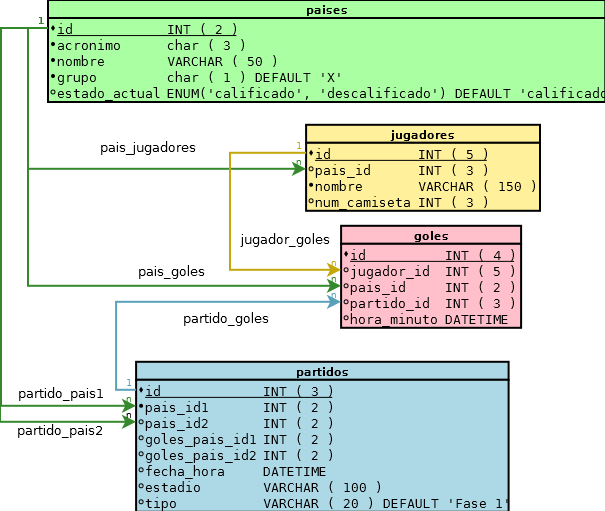

# Ejercicio completo.

## Trabajando con la base de datos mundial.

Observe el siguiente diagrama `E-R` que modela una base de datos que intenta recopilar un historial del mundial:

## Recopilando información.

En la actualidad es fácil obtener información de los hechos que acontecen el mundo, mucha de esta información se almacena en la base de datos de los servidores, desgraciadamente esta información suele estar en formatos inesperados, al proceso de repiración de datos y procesarlos se conoce como mineria de datos, la cual podemos definir como:

> ### Mineria de datos:
> La minería de datos o exploración de datos (es la etapa de análisis de "_Knowledge Discovery in Databases_" o **KDD**) es **un campo de las ciencias de la computación referido al proceso que intenta descubrir patrones en grandes volúmenes de conjuntos de datos**.1 Utiliza los métodos de la inteligencia artificial, aprendizaje automático, estadística y sistemas de bases de datos.
>
> **fuente:** <http://es.wikipedia.org/wiki/Miner%C3%ADa_de_datos>

### Obteniendo información de los países:

> https://gist.github.com/fitorec/27e7b8e8d3434af3bf05

### Relacionando partidos:

Observe y ejecute la siguiente consulta **SQL**:

	SELECT
			`id` AS `pais_id1`,
			(SELECT `id` FROM  `paises` WHERE  `acronimo` =  'cro') AS `pais_id2`,
			'1' AS `goles_pais_id1`,
			'3' AS `goles_pais_id2`,
			'2014-06-12 22:00:00' AS `fecha_hora`,
			'Arena de Sao Paulo' AS `estadio`
			FROM  `paises`
			WHERE  `acronimo` =  'bra';

Ahora siguiendo la siguiente página <http://as.com/especiales/futbol/mundial/2014/calendario.html> y algo de minería podemos obtener todos los partidos del mundial:

> <https://gist.github.com/fitorec/9c85e452a78342d0bdd2>

### Insertando Goles

Los goles normalmente son registrados en el momento que ocurre la acción, en **mysql** para realizar esta tarea podemos ocupar las funciones de [fecha y hora actual](http://dev.mysql.com/doc/refman/5.0/es/date-and-time-functions.html), ocupando específicamente la función Ahora(`NOW()`).
  
por ejemplo, observe la siguiente sentencia **SQL** y el resultado obtenido:

	mysql> SELECT NOW();
	        -> '2014-06-18 9:10:26'

> Pruebe usted mismo.
> 
## Subconsultas.

MySQL 5.0 soporta todas las formas de subconsultas y operaciones que requiere el estándar SQL, así como algunas características específicas de MySQL.

> fuente: <http://dev.mysql.com/doc/refman/5.0/es/subqueries.html>

Podemos hacer uso del `ANY`, `IN` y `SOME`[[ver doc](http://dev.mysql.com/doc/refman/5.0/es/any-in-some-subqueries.html)], por ejemplo:

	SELECT
		Jugador.nombre, Jugador.numero
	FROM
		jugadores AS Jugador
	WHERE
		Jugador.pais_id IN (
				SELECT pais_id1 AS pais_id
				WHERE fecha_hora = '2014-06-17 14:00:00'
		);
En este caso estamos seleccionando todos los jugadores del `equipo 1` de algún determinado partido que se jugo a las `'2014-06-17 14:00:00'`.

## Documentación:

 - [simular claves foraneas myIsam](http://dev.mysql.com/doc/refman/5.0/es/example-foreign-keys.html)
 - [Claves foraneas con innoDB](http://dev.mysql.com/doc/refman/5.0/es/innodb-foreign-key-constraints.html)
 - [Restricciones (constraints) FOREIGN KEY, 15.6.4. Doc Mysql](http://dev.mysql.com/doc/refman/5.0/es/innodb-foreign-key-constraints.html)
 - [Sub consultas SQL](http://dev.mysql.com/doc/refman/5.0/en/subqueries.html)

