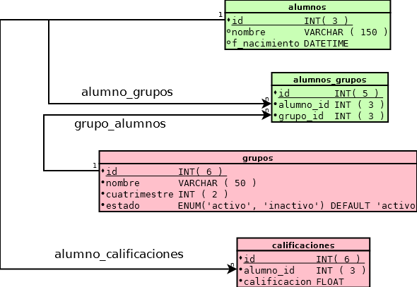

# Examen de Bases de datos Parcial II

> Lea detenidamente las siguientes preguntas y responda lo que se te indica:

**1.-** Agregue escriba el código **SQL** que describa la tablas: `alumnos`, `alumnos_grupos`, `grupos` y `calificaicones`(valor 2 puntos):

**2.-** Escriba el código **SQL** que nos defina las restricciones: `alumno_grupos`, `grupo_alumnos`, `alumno_calificaciones` (valor 2 puntos):

**3.-** Cual es la parabra reservada que emplea _**mySQL**_ para definir una restrincción(Valor 1 punto):

 - CHECK
 - CONSTRAINT 
 - CONDITION
 - CLAMPDOWN
 - RESTRAINT
	

**4.-** Considerando que la base de datos del diagrama se encuentra vacía y que existen las restricciones del ejercicio 2, observe las siguiente instrucción SQL y describa lo que sucede tras su ejecución(Valor 1 punto):

	INSERT INTO `alumnos`(id, nombre, f_nacimiento)
	VALUES (NULL, 'Juanito Garcia', '1993-10-03'),
		   (NULL, 'Maria Mercedez', '1994-06-09');

**5.-** Escriba una consulta **SQL** que nos permita obtener todas las calificaciones del(os) alumno(s) que su nombre inicie con _"Juan"_(Valor 2 punto):

**6.-** Escriba los 4 tipos de integridad que vimos y describa brevemente cada una(Valor 2 punto):

