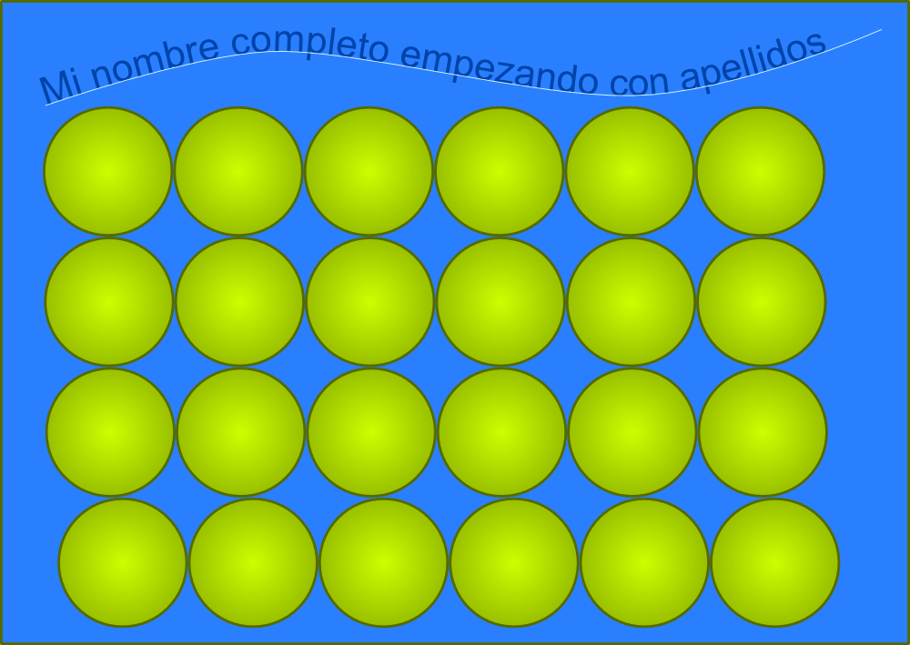
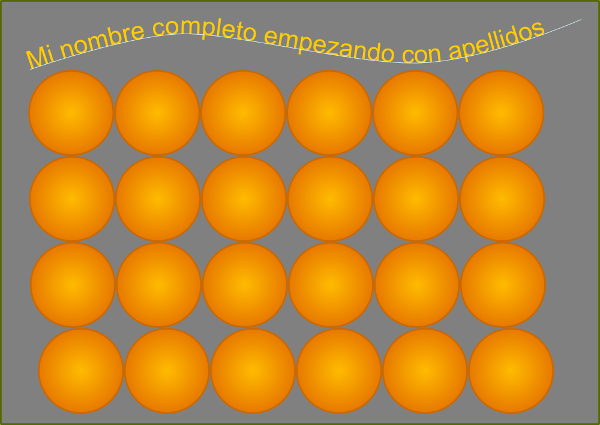

# Informatica 4

## Examen practico.

### Ejercicio 1.

En la medida de lo posible intente duplicar la siguiente imagen:

>**Tip**: Recuerde su herramienta de alinear y distribuir.

### Ejercicio 2.

En la medida de lo posible intente duplicar la siguiente imagen:

>**Tip**: Si usted clono las circunferencias en el ejercicio 1, todo se facilita ;¬)

### Ejercicio 3.

Utilizando la siguiente imagen:

Genere la siguiente imagen:

>**Tip** Recuerde como vectorizar un mapa de bits.