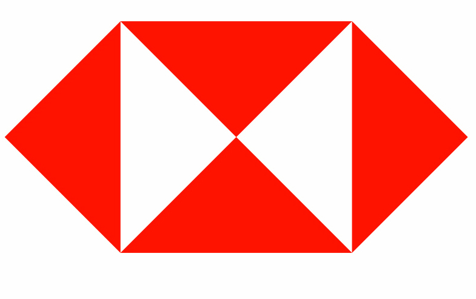

# Examen: Informática 4.

> Lea detenidamente y siga las siguientes instrucciones, al finalizar van a enviar sus trabajos a la direccción <chanerec@gmail.com>.

#### 1.- Ocupando la [imagen base de una lata](./lata.svg) y la fuente [**Loki Cola**](loki_cola.zip) realize una imagen similar pero con su nombre y apellido:

#### 2.- Realice el logotipo del **HSBC** que se muestra a continuación:

#### 3.- Realice el logotipo del **nike** que se muestra a continuación:

