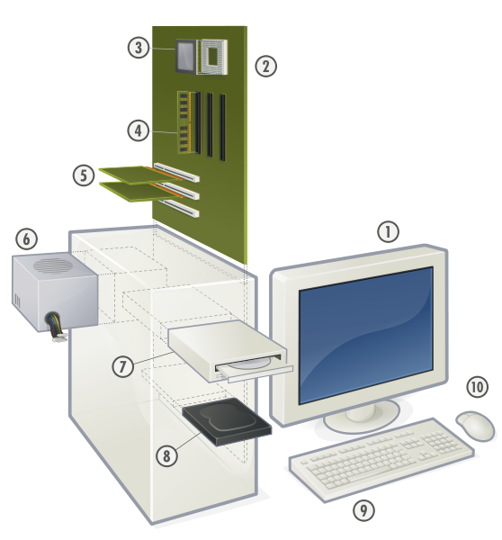

# hardware

El término _**hardware**_  se refiere a todas las partes tangibles de un sistema informático; sus componentes son: eléctricos, electrónicos, electromecánicos y mecánicos.

Son cables, gabinetes o cajas, periféricos de todo tipo y cualquier otro elemento físico involucrado; contrariamente, el soporte lógico es intangible y es llamado software. El término es propio del idioma inglés (literalmente traducido: partes duras), su traducción al español no tiene un significado acorde, por tal motivo se la ha adoptado tal cual es y suena; la Real Academia Española lo define como _«Conjunto de los componentes que integran la parte material de una computadora»._

El término, aunque sea lo más común, no solamente se aplica a las computadoras; del mismo modo, también un robot, un teléfono móvil, una cámara fotográfica o un reproductor multimedia poseen hardware (y software).

La historia del hardware de computador se puede clasificar en cuatro generaciones, cada una caracterizada por un cambio tecnológico de importancia. Una primera delimitación podría hacerse entre hardware básico, el estrictamente necesario para el funcionamiento normal del equipo, y complementario, el que realiza funciones específicas.

Hardware típico de una computadora personal:

 - 1. Monitor.
 - 2. Placa principal.
 - 3. Microprocesador (CPU) y zócalo.
 - 4. Un módulo de RAM y tres ranuras.
 - 5. Dos tarjetas de expansión y tres ranuras.
 - 6. Fuente de alimentación.
 - 7. Unidad de disco óptico (CD; DVD; BD).
 - 8. Unidad de disco duro ó unidad de estado sólido.
 - 9. Teclado.
 - 10. Ratón.