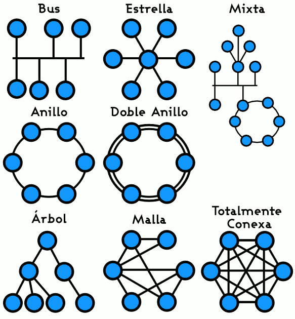
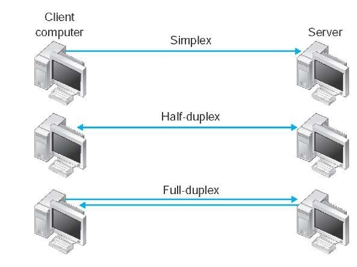

# Red de computadoras

Una **red de computadoras**, también llamada **red de ordenadores, red de comunicaciones de datos** o **red informática**, es un conjunto de equipos informáticos y software conectados entre sí por medio de dispositivos físicos que envían y reciben impulsos eléctricos, ondas electromagnéticas o cualquier otro medio para el transporte de datos, con la finalidad de compartir información, recursos y ofrecer servicios.

Como en todo proceso de comunicación se requiere de un emisor, un mensaje, un medio y un receptor. La finalidad principal para la creación de una red de computadoras es compartir los recursos y la información en la distancia, asegurar la confiabilidad y la disponibilidad de la información, aumentar la velocidad de transmisión de los datos y reducir el costo general de estas acciones.

Un ejemplo es Internet, la cual es una gran red de millones de computadoras ubicadas en distintos puntos del planeta interconectadas básicamente para compartir información y recursos.

## nodo

Es un punto de intersección, conexión o unión de varios elementos que confluyen en el mismo lugar.

-------------------------------------------------------

# Alacance:

## Red de área local, o LAN (Local Area Network)

Es una red que se limita a un área especial relativamente pequeña tal como un cuarto, un solo edificio, una nave, o un avión. Las redes de área local a veces se llaman una sola red de localización. No utilizan medios o redes de interconexión públicos.

## Red de área local inalámbrica, o WLAN (Wireless Local Area Network)

Es un sistema de comunicación de datos inalámbrico flexible, muy utilizado como alternativa a las redes de área local cableadas o como extensión de estas.

## Redes de área amplia, o WAN (Wide Area Network)

Son redes informáticas que se extienden sobre un área geográfica extensa utilizando medios como: satélites, cables interoceánicos, Internet, fibras ópticas públicas, etc.

--------------------------------------------------------

# Topología

** Red en bus** Se caracteriza por tener un único canal de comunicaciones (denominado bus, troncal o backbone) al cual se conectan los diferentes dispositivos.

**red en anillo:** Cada estación está conectada a la siguiente y la última está conectada a la primera.

**Estrella:** Las estaciones están conectadas directamente a un punto central y todas las comunicaciones se han de hacer necesariamente a través de éste.

**Red en malla:** Cada nodo está conectado a todos los otros.

** Red en árbol:** Los nodos están colocados en forma de árbol. Desde una visión topológica, la conexión en árbol es parecida a una serie de redes en estrella interconectadas salvo en que no tiene un nodo central.

**Red mixta:** Se da cualquier combinación de las anteriores.

----------------------------------------------------

-------------------------------------------------

# Direccionalidad de los datos

## Simplex o unidireccional:

un equipo terminal de datos transmite y otro recibe.

## Half-duplex,en castellano semidúplex:

el método o protocolo de envío de información es bidireccional pero no simultáneobidireccional, sólo un equipo transmite a la vez.

## Full-duplex, o dúplex,:
los dos equipos involucrados en la comunicación lo pueden hacer de forma simultánea, transmitir y recibir.

--------------------------------------------------------

-------------------------------------------------------

# Grado de autentificación

## Red privada:

es una red que solo puede ser usada por algunas personas y que está configurada con clave de acceso personal.

## Red de acceso público:

una red pública se define como una red que puede usar cualquier persona y no como las redes que están configuradas con clave de acceso personal. Es una red de computadoras interconectados, capaz de compartir información y que permite comunicar a usuarios sin importar su ubicación geográfica.

--------------------------------------------------

# grado de difusión

## Una intranet

Es una red de ordenadores privados que utiliza tecnología Internet para compartir dentro de una organización parte de sus sistemas de información y sistemas operacionales.

## Internet

Es un conjunto descentralizado de redes de comunicación interconectadas que utilizan la familia de protocolos TCP/IP, garantizando que las redes físicas heterogéneas que la componen funcionen como una red lógica única, de alcance mundial.