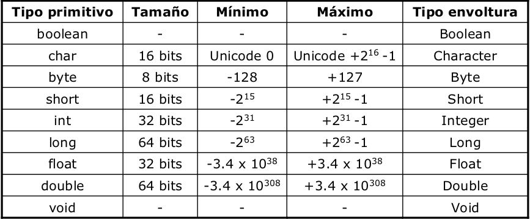

JAVA BÁSICO
=============================================================================

-----------

# Programación orientada a objetos.

La programación orientada a objetos se basa en la programación
de clases, siguiendo las siguientes reglas:

 - Un programa se construye a partir de un conjunto de clases.

 - **Clase**: una agrupación de **atributos** (variables) y de
métodos(funciones), que operan sobre los datos.

 - A estos datos y funciones pertenecientes a una clase se les
denomina **atributos** y **métodos**.

 - Todos los métodos y atributos se definen dentro del bloque de la
clase.

-----------

# Conceptos importantes de la POO:

## Encapsulación:

Las estructuras de datos y los detalles de la
implementación de una clase se hallan **ocultos** de
otras clases del sistema.

Control de acceso a variables y métodos, accesso:

 - **private:** sólo pueden ser accedidos desde dentro de la clase (no desde las subclases).

 - **protected:** sólo pueden ser accedidos dentro de la clase, las subclases de la clase y las clases del paquete.

 - **public:** cualquier clase desde cualquier lugar puede acceder a
las variables y métodos

 - **friendly o package:** (opción por defecto si no se indica nada):
son accesibles por todas las clases dentro del mismo paquete,
pero no por los externos al paquete (es como si fuese public,
pero sólo dentro del package)

-----------

# Conceptos importantes de la POO:

## Herencia:

 - Una clase (subclase) puede derivar de otra(superclase).
 - La subclase hereda todas los atributos y métodos de la superclase.
 - Las subclase puede redefinir y/o añadir atributos y métodos.
 - Fomenta la reutilización de código.

## Polimorfismo:

Es la capacidad de tener métodos con el mismo nombre (y argumentos) y diferente implementación.

Una operación puede tener más de un método que la implementa.

------------------------------------------------

# Tipos primitivos

El tamaño de los tipos no varía entre sistemas operativos:

------------------------------------------------

# Primitivos y Clases envoltura:

Clases envoltura de los tipos primitivos:

Se puede declarar un tipo primitivo como no
primitivo (manejo como objeto). Ejemplo:

	!java
	char c = 'x';
	Character C = new Character('x');
	c = C.charValue();

------------------------------------------------

# Operadores

 - **Aritméticos:** `+, -, *, /, %`
 - **Asignación:** `=, +=, -=, *=, /=, %=`
 - **Autoincrementales:** `++, --`
 - **Relacionales:** `>, >=, <, <=, ==, !=`
 - **Lógicos:** `&&, ||, !, &, |`
 - **Concatenación de cadenas:** `+`

## Ejemplo numericos:

	!java
	d = e++; // Se asigna e a d y luego se incrementa e
	d = ++e; // Se incrementa e y luego se asigna e a d

	a += b; // equivale a x = x + y;
	a *= b; // equivale a x = x * y;

	c = 3;
	a = c++; // Resultado: a = 3 y c = 4
	a = ++c; // Resultado: a = 4 y c = 4

------------------------------------------------
# Operadores

## Ejemplo cadenas:

	!java
	String concatenado  = “perro” + “gato”
	// Resultado perrogato

# Comentarios

	!java
	// comentarios para una sola línea

	/* comentarios de una
	 * o más líneas
	 **/

------------------------------------------------

# Metodos:

 - Para devolver valores: **return**.
 - El método termina:
  - Al llegar a la llave de cierre ó
  - Al ejecutar el return
 - Si el método no es de tipo void debe terminar siempre con un return
 - Si el método es de tipo void se puede forzar el fin con la instrucción: `return;`.

------------------------------------------------

#Ejemplo metodo:

