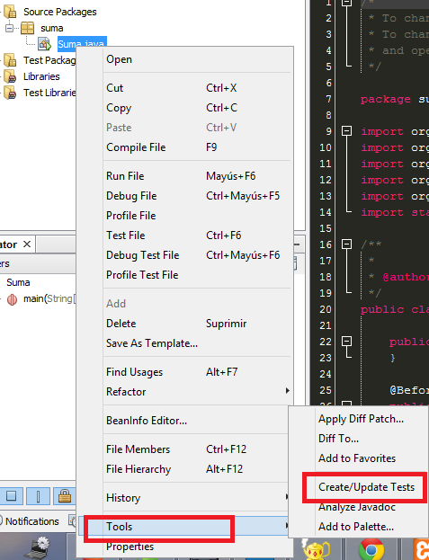

Pruebas Unitarias
============================================================================

Los **tests unitarios** son una forma de probar el correcto
funcionamiento de un módulo o una parte del sistema.

Con el fin de asegurar el correcto funcionamiento de todos
los módulos por separado y evitar así errores futuros en el
momento de la integración de todas sus partes.

La idea es escribir casos de prueba para cada función no
trivial o método en el módulo, de forma que cada caso sea
independiente del resto.

------------------------------------------------------------

Pruebas Unitarias en Java con  JUnit
============================================================================

**JUnit** es ya de por sí un _framework_ que facilita en demasía el desarrollo de prueba unitarias, pero ahora la versión 4 simplifica más el desarrollo de éstas por medio de la explotación de las anotaciones otorgadas por Java 5, eliminando el desarrollo de pruebas basado en _subclassing_, _reflection_ y convenciones de nombrado.

La intención de [**Kent Beck**](http://en.wikipedia.org/wiki/Kent_Beck) (creador de **JUnit** junto con **Erich Gamma**) con esta nueva versión, es animar a más desarrolladores a escribir más pruebas unitarias por medio de la simplificación de **JUnit**.

## Métodos de prueba

Con JUnit 4 para señalar un método de prueba lo anotaremos con **`@Test`**. **No será necesario heredar de la clase TestCase para hacer uso de los métodos assertXXX()** y podremos hacer uso de ellos mediante la utilización de importaciones estáticas, característica proporcionada por Java 5.

----------------------------------------------------------------------------

## Ejemplo1

	!java
	public class PruebaAlgunaClase {
	  @Test
	  public void pruebaFuncionX() {
	    assertEquals(
			"Error no corresponde al valor esperado",
			"valor Esperado",
			AlgunaClase.funcionX()
		);
	  }
	}

-----------------------------------------------------------
# Plantilla de ejemplo.

	!java
	/**
	 * Template de un TestCase común para JUnit
	 * @author iuga
	 */
	public class miPruebaJnit {
	 
	    private AgunObjeto ob;
	 
	    public miPruebaJnit() {
	    }
	}

----------------------------------------------------------

# Metodos basicos

## Metodos previos a la ejecución:

	!java
	public class miPruebaJnit {
		@BeforeClass
		public static void setUpClass() throws Exception {
			// Primer Método a Ejecutar cuando se
			// lancen los Test
		}
	
		@Before
		public void setUp() {
		    // Clase q se va a utilizar para setear los datos a
		    // todos los objetos que necesitemos, es el inicializador
		    // Tal cual el initComponents del NetBeans
		}
	}

----------------------------------------------------------

# Metodos basicos

## Metodos posterior a la ejecución:

	!java
	public class miPruebaJnit {
		@AfterClass
		public static void tearDownClass() throws Exception {
		    // Método que se ejecuta cuando se terminan los test
		    // Es útil para cerrar bases de datos, archivos,
		    // Exploradores, Streams, etc.
		}
	
		@After
		public void tearDown() {
		    // Último método que se ejecuta cuando se terminan los test
		    // Es útil para cerrar bases de datos, archivos,
		    // Exploradores, Streams, etc.
		 }
	}

----------------------------------------------------------

# Metodos basicos

## Metodos Test:

	!java
	public class miPruebaJnit {
		/**
		* Prueba sobre el metodo guardar, de la clase miPruebaJnit.
		* Todos los metodos que tengan la anotacion @Test seran
		* ejecutados por JUnit no importa si no se llaman.
		*/
		@Test
		public void testGuardar() {
			int id = 0;

	        // Pruebo los métodos que necesito
 
	        if(result==0) {
	            // Lanzo fail() cuando el Test falló a lo que yo
	            // esperaba, por ejemplo el dato de un algoritmo
	            // que es un resultado erroneo
	            fail("The test case is a prototype.");
	        }
	    }
	}

-----------------------------------------------------------

# Creando JUnit desde netbeans

## Creamos el proyecto Suma

-----------------------------------------------------------

# Creamos un caso de prueba para alguna clase

