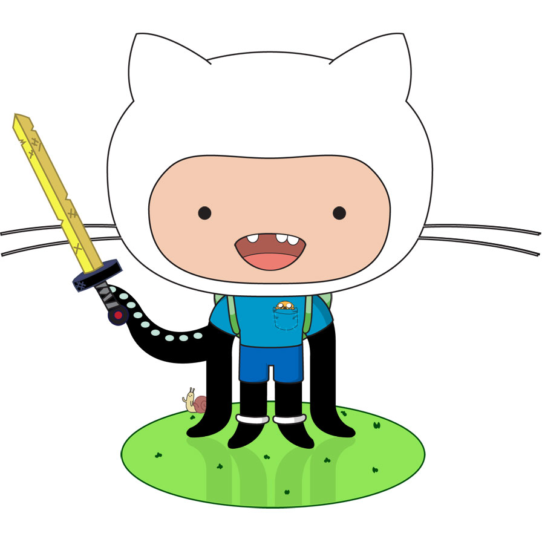

#Proyecto Final.

El proyecto final consiste en generar la lógica de un determinado juego:

## Juegos:
 - Juego del Gato
 - Cuatro en Raya
 - Memorama

## Entregables:

Van a entregar un documento en donde expliquen las siguientes acciones:

 - Como detectar cuando el juego ha terminado.
 - Como detectar si en el siguiente tiro podemos ganar.
 - Como detectar si en el siguiente tiro podemos perder.
 - Que estrategias estará implementando su juego.

## Acceso a la aplicación:

La aplicación esta desarrollada con [phonegap](https://build.phonegap.com/) y se encuentra hospedado en [github](https://github.com/fitorec/phonegab-tst):

> Proyecto en **GitHub**: <https://github.com/fitorec/phonegab-tst>

Usted puede descargar la aplicación desde con el siguiente código QR:

> 

 ------------------
# La vida es mas que una aventura con Git

