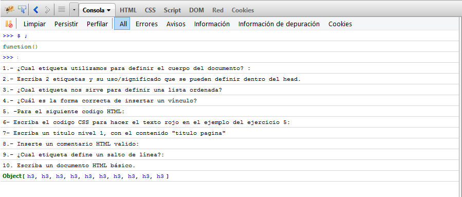

### 1.- ¿Cual etiqueta utilizamos para definir el cuerpo del documento? :

 - A `<background>`
 - B `<body>`
 - C `<b>`

### 2.- Escriba 2 etiquetas y su uso/significado que se pueden definir dentro del `head`.

### 3.- ¿Cual etiqueta nos sirve para definir una lista ordenada?

- A  `<list>`
- B  `<ul>`
- C  `<li>`
- D  `<ol>`

### 4.- ¿Cuál es la forma correcta de insertar un vínculo?

- A  `<a target="http://www.unsitio.com">...</a>`
- B  `<a src="http://www.unsitio.com">...</a>`
- C  `<a href="http://www.unsitio.com">...</a>`

### 5. -Para el siguiente codigo HTML:
	
...
	

Marque los selectores validos:

- A `#parrafo`
- B `.parrafo`
- C `p.parrafo`
- D `#p.parrafo`

### 6- Escriba el codigo CSS para hacer el texto rojo en el ejemplo del ejercicio 5:

### 7- Escriba un titulo nivel 1, con el contenido "titulo pagina"

### 8.- Inserte un comentario HTML valido:

### 9.- ¿Cual etiqueta define un salto de línea?:

### 10. Escriba un documento HTML básico.

## Skill

> Utilizando jQuery muestre en la consola de Javscript todas, las preguntas de este examen:

> Tips: todas las preguntas en el examen estan bajo titulo nivel 3, usted puede ucupar la función [`$each`](http://api.jquery.com/jquery.each/) de jquery:

;