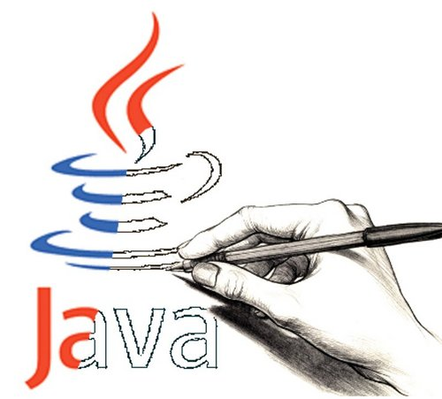
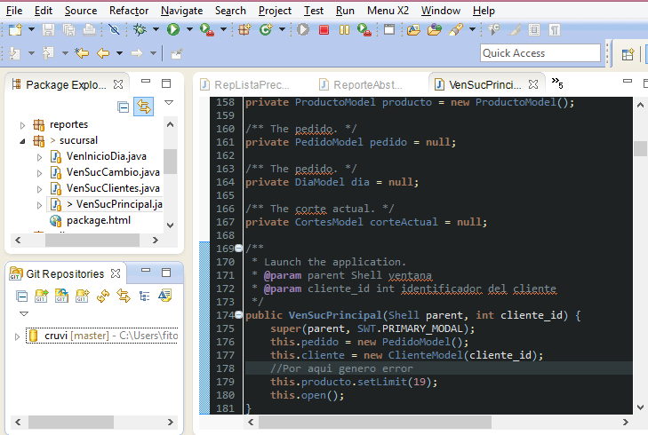
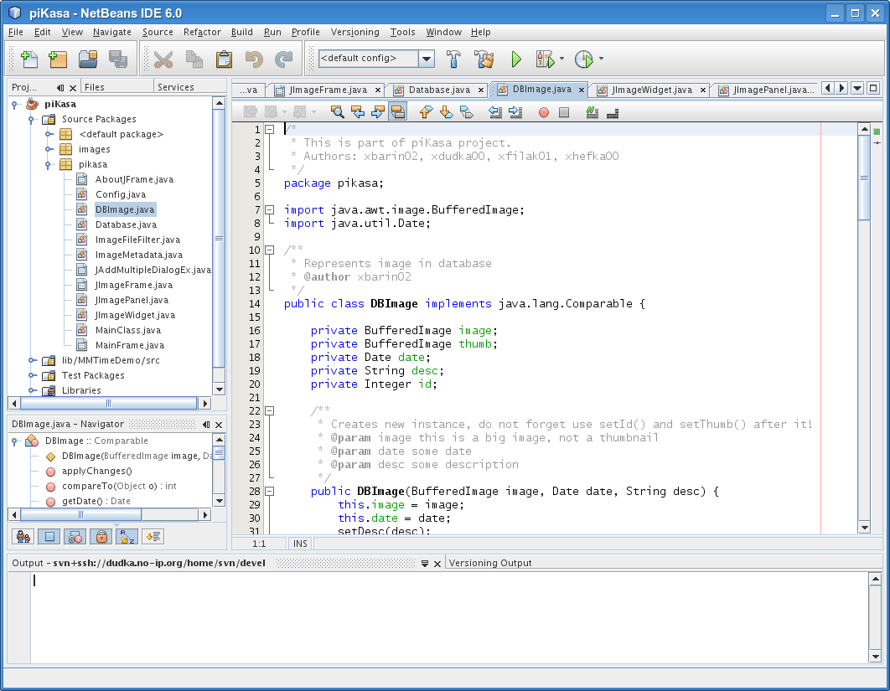

Programación II
===============================================

Ambientes visuales de desarrollo para Java 
---------------------------------------------

En la siguiente presentación analizaremos los entornos de programación disponibles para **Java**, con la intensión de que tomemos la decisión de con cual estaremos trabajando durante el curso.

---------------------------------------------

## Eclipse:

---------------------------------------------

### Características de Eclipse

 - Trabaja con el Standard/SDK
 - La versión actual es la `Kepler Service Release 2`
   - Build id: 20140224-0627
 - Licencia de distribución [apache](http://apache.org/)
 -  [Soporta para temas](http://eclipsecolorthemes.org/?view=how-to-use)
 -  Integración con **git** y **subversion** como control de versiones.
 -  [Integración swt](http://www.eclipse.org/swt/) para el desarrollo de interfaces gráficas.
 -  Existe una versión para la [integración de andriod](http://developer.android.com/sdk/index.html?hl=sk)

---------------------------------------------

## Netbeans:

---------------------------------------------

### Características de Netbeans

 - Trabaja con el Standard/SDK
 - La versión actual [es la `8.0`](https://netbeans.org/community/releases/80/relnotes.html)
   - Build id: 20140224-0627
 - Licencia de distribución: [Acuerdo de colaborador de Oracle (OCA) sin embargo el código fuente de netbeans se publica sobre la licencia GPL2](https://netbeans.org/about/legal/index.html).
 -  Integración con **git** y **subversion** como control de versiones.
 -  [Integración swt](http://www.eclipse.org/swt/) para el desarrollo de interfaces gráficas.
 -  Es desarrollado y mantenido por [**oracle**](http://oracle/)
 

---------------------------------------------

 [Volver al Inicio](../../index.html)
====================================================
