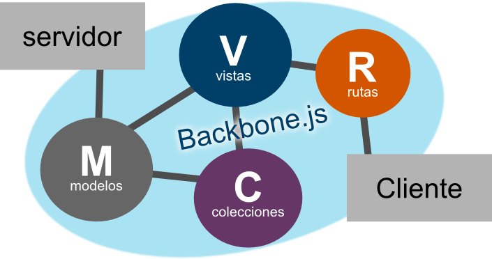

#Curso Backbone.js

**Backbone.js** es una librería JavaScript que nos permite crear aplicaciones/sitios web que requieren de una basta interacción con el cliente, agregando la lógica del patrón MV* al ofrecer una estructura basada en **modelos** con la unión `clave-valor` , colecciones con una API de funciones enumerables, **vistas** asociadas con el control de eventos personalizados y mediante a su sistema de **enrutamiento** sincroniza las modelos/vistas/colecciones a la API JSON de tu aplicación/sitio.

En el taller se desarrollara una aplicación sencilla en donde se explicara el uso de Backbone.js, sus conceptos básicos, aspectos de configuración y de como combinar esta herramienta con algún otro framework backend.

------------------------------------------

# ¿Como funciona Backbone.js?

La siguiente figura ilustra como funciona una típica aplicación con **Backbone.js**:

------------------------------------------

# 1 Modelos

----------------------------------------------------

# 1.0 - Modelos de Backbone

Los modelos representan los datos de la aplicación y la lógica alrededor de estos datos.

Creamos un archivo llamado platica en `/js/models/platica.js`, con el siguiente contenido:

    !javascript
	var Platica = Backbone.Model.extend({
		initialize: function () {
			//Aquí agregamos los callbacks del modelo
			this.on('change', function (){
				console.log(this);
			});
		},
		urlRoot : '/platicas'
		defaults: {
			nombre: '',
			ponente: '',
			hora   : 'Por Confirmar'
		}
	});

----------------------------------------------------

# 1.1 Usando el Modelo

## Creando un modelo

    !javascript
	var platica = new Platica({
		nombre  : 'Taller de backbone',
		ponente : 'Fitorec'
	});

	platica.toJSON();

## Leyendo datos
	!javascript
	var platica1 = new Platica({
		id  : 1
	});

	// GET: /platicas/1
	platica1.fetch();
	platica1.toJSON();

------------------------------------------

# 1.2 Persistencia de datos

## Agregando & actualizando datos
	!javascript
	var nuevaPlatica = new Platica({
		nombre  : 'Platica sobre nodejs',
		ponente : 'Alguien'
	});

	// POST: /platicas/
	//Si tuviera definido el 'id'
	// PUT: /platicas/id
	nuevaPlatica.save();
	nuevaPlatica.toJSON();

## Borrando un registro.

	!javascript
	// DELETE: /platicas/1
	platica1.destroy();

------------------------------------------

# 1.3 Validación y otros tips:

## Agregando validación
	!javascript
	var Platica = Backbone.Model.extend({
		validate: function (atributos) {
			if(!atributos.nombre) {
				return "el campo nombre es obligatorio";
			}
		}
	});
	
	var platica = new Platica();
	platica.save();